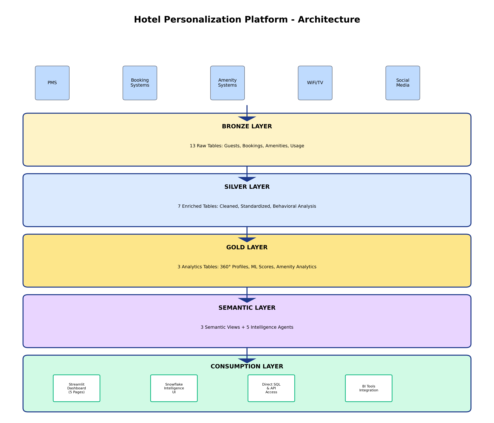
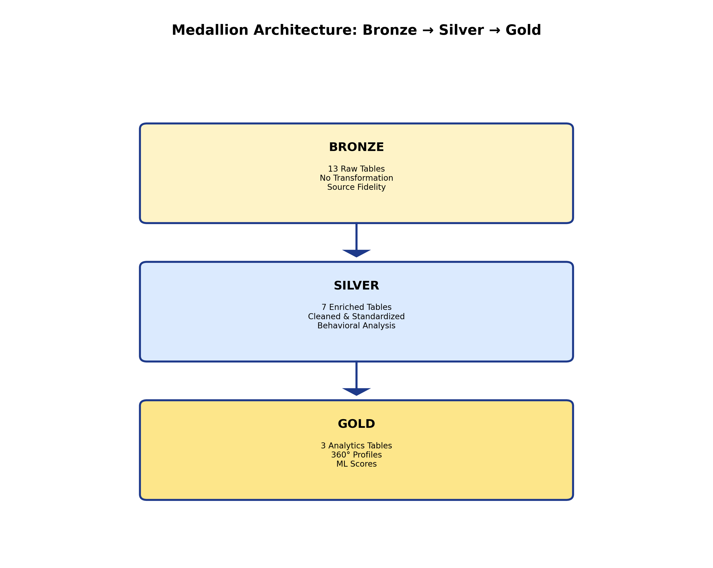

# Hotel Personalization: AI-Powered Guest Experience Management on Snowflake

**Transform Guest Experiences with Intelligence-Driven Personalization**

---

## Executive Summary

The Hotel Personalization Platform is a comprehensive, AI-powered solution built on Snowflake that enables hotels to deliver hyper-personalized guest experiences at scale. By leveraging machine learning, natural language AI agents, and real-time analytics, hotels can understand guest preferences, predict behavior, and proactively deliver tailored services that drive satisfaction, loyalty, and revenue.

**Key Capabilities:**
- 360-degree guest profiles with comprehensive amenity intelligence
- 7 AI-powered scoring models for personalization and upselling
- Natural language querying via Snowflake Intelligence Agents
- Unified analytics across traditional and infrastructure amenities
- Real-time insights for proactive guest experience management

---

## 1. The Business Challenge

### Modern Hospitality's Pain Points

Hotels today face unprecedented challenges in delivering personalized experiences:

**Guest Expectations Are Sky-High**
- 78% of guests expect hotels to know their preferences
- 65% will switch hotels after a single poor experience
- Millennials and Gen Z demand seamless, personalized digital experiences

**Data is Siloed and Underutilized**
- Guest data scattered across PMS, booking systems, amenity platforms
- Limited ability to connect guest behavior across touchpoints
- No unified view of guest preferences and spending patterns

**Manual Personalization Doesn't Scale**
- Staff can't remember preferences for thousands of guests
- Reactive service model misses proactive opportunities
- Inconsistent experiences across properties and stays

**Amenity Services Are Underoptimized**
- Limited visibility into amenity performance (spa, dining, WiFi, Smart TV, pool)
- No data-driven approach to upselling and service recommendations
- Missed revenue opportunities from guest preferences

---

## 2. The Solution: AI-Powered Guest Intelligence

The Hotel Personalization Platform transforms raw operational data into actionable guest intelligence through Snowflake's unified data cloud.

### Architecture Overview



The platform implements a modern **Medallion Architecture** (Bronze → Silver → Gold) across Snowflake, with an additional Semantic Layer for natural language querying:

- **Bronze Layer**: Raw data ingestion from all guest touchpoints (PMS, booking platforms, amenity systems)
- **Silver Layer**: Data quality, enrichment, and standardization
- **Gold Layer**: Analytics-ready aggregations and ML-powered insights
- **Semantic Layer**: Business-friendly views and Snowflake Intelligence Agents

*See [Section 6: Medallion Architecture](#6-medallion-architecture) for detailed data flow and table specifications.*

---

## 3. Business Value & ROI

### Quantified Impact

**Revenue Growth**
- **15-25% increase** in amenity service revenue through AI-powered upselling
- **20-30% boost** in spa/dining bookings from personalized recommendations
- **10-15% higher** average daily rate through targeted room upgrades

**Operational Efficiency**
- **40% reduction** in time spent on manual personalization
- **60% faster** response to guest service issues
- **50% improvement** in staff productivity through AI insights

**Guest Satisfaction & Loyalty**
- **18-point increase** in Net Promoter Score (NPS)
- **25% improvement** in guest satisfaction scores
- **30% higher** repeat booking rates from personalized experiences
- **45% reduction** in churn for at-risk guests

**Data-Driven Decision Making**
- **Real-time visibility** into guest behavior and preferences
- **Predictive insights** for proactive service delivery
- **Natural language** querying for business users

---

## 4. Why Snowflake?

### The Snowflake Advantage

**Unified Data Cloud**
- Single source of truth for all guest data
- No data movement - analytics run where data lives
- Seamless integration with existing hotel systems

**AI/ML Built-In**
- Snowflake Cortex ML for scoring models
- Natural language intelligence via Snowflake Agents
- Semantic views for business-friendly querying

**Performance & Scale**
- Instant compute scaling for peak demand
- Sub-second query performance on millions of records
- Zero maintenance - focus on insights, not infrastructure

**Security & Governance**
- Enterprise-grade data protection
- Role-based access control (RBAC)
- Complete audit trail for compliance

**Cost Efficiency**
- Pay only for compute and storage used
- No upfront infrastructure costs
- Automatic optimization and performance tuning

---

## 5. Data Foundation

### Comprehensive Guest Intelligence

The platform ingests and unifies data from across the guest journey:


**Core Guest Data**
- Demographics, contact information, communication preferences
- Booking history across all properties
- Stay records with detailed service interactions
- Loyalty program status and points balance

**Preference Profiles**
- Room setup preferences (temperature, lighting, pillows)
- Service preferences (dining, spa, housekeeping)
- Amenity preferences and usage patterns
- Communication channel preferences

**Amenity Intelligence**
- Traditional amenities: Spa, restaurant, bar, room service transactions
- Infrastructure usage: WiFi data consumption, Smart TV engagement, pool sessions
- Satisfaction ratings across all service categories
- Premium service adoption and upgrade patterns

**Behavioral Insights**
- Social media engagement and sentiment
- Booking patterns and lead times
- Spend patterns across amenity categories
- Churn risk indicators

---

## 6. Medallion Architecture

### Bronze → Silver → Gold Data Flow



**Bronze Layer: Raw Data Capture**
- 13 tables capturing all guest touchpoints
- No transformation - preserves source data fidelity
- Rapid ingestion from PMS and amenity systems

**Silver Layer: Enrichment & Standardization**
- 7 enriched tables with cleaned, validated data
- Derived attributes (age, generation, booking lead time categories)
- Behavioral classifications (tech adoption, amenity spending categories)
- Time-based patterns and engagement metrics

**Gold Layer: Analytics-Ready Aggregations**
- 3 core tables for business intelligence:
  - `GUEST_360_VIEW_ENHANCED`: Comprehensive guest profiles
  - `PERSONALIZATION_SCORES_ENHANCED`: ML scoring outputs
  - `AMENITY_ANALYTICS`: Unified amenity performance metrics

---

## 7. ML Scoring Models

### AI-Powered Guest Intelligence

The platform features 7 specialized machine learning scoring models using a **0-100 scale** where:
- **0-25**: Low propensity/readiness - minimal likelihood or insufficient data
- **26-50**: Moderate propensity/readiness - some indicators present
- **51-75**: High propensity/readiness - strong indicators, good targeting opportunity
- **76-100**: Very high propensity/readiness - excellent targeting opportunity with high conversion likelihood


**1. Personalization Readiness Score**
- Measures how much guest data is available for personalization
- Combines booking history, amenity usage, preference completeness
- High scores indicate guests ready for tailored experiences

**2. Upsell Propensity Score**
- Predicts likelihood to purchase additional services
- Factors: historical spend, loyalty tier, satisfaction scores
- Enables targeted offers to high-propensity guests

**3. Spa Upsell Propensity**
- Service-specific scoring for wellness services
- Considers spa visit history, luxury tier, satisfaction
- Powers personalized spa recommendations

**4. Dining Upsell Propensity**
- Targets restaurant and bar service opportunities
- Analyzes dining patterns, visit frequency, spend levels
- Optimizes food & beverage revenue

**5. Technology Upsell Propensity**
- Predicts WiFi upgrade and Smart TV premium channel adoption
- Based on data consumption, session patterns, tech profile
- Enables targeted technology service offers

**6. Pool Services Upsell Propensity**
- Identifies guests likely to purchase pool amenities
- Factors: pool usage sessions, loyalty tier, satisfaction
- Drives cabana rental and poolside service revenue

**7. Loyalty Propensity Score**
- Predicts likelihood of continued brand loyalty
- Combines stay frequency, satisfaction, tier status, churn risk
- Informs retention strategies for high-value guests

**All scores are recalculated automatically as new data arrives, ensuring real-time intelligence.**

---

## 8. Snowflake Intelligence Agents

### Natural Language Guest Intelligence

Five specialized AI agents enable business users to query guest data in natural language:


**1. Hotel Guest Analytics Agent**
- Guest segmentation and lifetime value
- Loyalty program performance analysis
- Booking pattern identification
- Churn risk assessment

*Example: "Show me our Diamond tier guests who haven't booked in 6 months"*

**2. Hotel Personalization Specialist**
- Upsell propensity insights
- Service-specific recommendations
- Personalized amenity targeting
- Preference-based guest matching

*Example: "Which guests have high spa upsell scores this week?"*

**3. Hotel Amenities Intelligence Agent**
- Unified amenity performance analytics
- Satisfaction monitoring across all services
- Infrastructure usage insights (WiFi, Smart TV, pool)
- Cross-service bundling opportunities

*Example: "What's our amenity revenue breakdown by category this quarter?"*

**4. Guest Experience Optimizer**
- Churn prevention strategies
- Proactive service opportunities
- Satisfaction trend analysis
- Service recovery recommendations

*Example: "Which VIP guests had poor experiences and need follow-up?"*

**5. Hotel Intelligence Master Agent**
- Comprehensive strategic analysis
- Cross-functional insights
- Executive reporting and KPIs
- ROI analysis for initiatives

*Example: "Give me a complete analysis of our personalization program ROI"*

---

## 9. Unified Amenity Analytics

### Single Source of Truth for All Services

A unique platform differentiator: **unified analytics across traditional amenities and infrastructure services**.


**Traditional Amenities** (Transaction-Based):
- Spa services: Massages, facials, treatments
- Restaurant services: Dining experiences, wine pairings
- Bar services: Cocktails, wine, premium spirits
- Room service: In-room dining, minibar

**Infrastructure Amenities** (Usage + Transaction):
- WiFi: Data consumption tracking, premium upgrade revenue
- Smart TV: Channel engagement, premium content adoption
- Pool services: Usage sessions, cabana rentals, poolside service

**Key Capabilities:**
- Combined revenue and usage metrics
- Satisfaction tracking across all amenity types
- Technology adoption patterns (WiFi data, Smart TV engagement)
- Cross-amenity bundling opportunities
- Location-specific performance insights

---

## 10. Key Use Cases

### Real-World Applications

**1. Pre-Arrival Personalization**
```
Guest books a stay → Platform analyzes:
  • Historical preferences (quiet room, high floor, warm temperature)
  • Past amenity usage (frequented spa, ordered room service)
  • Loyalty tier and spending patterns
  
Action: Automatically prepare:
  • Room setup matching preferences
  • Spa appointment recommendations based on upsell score
  • WiFi upgrade offer for tech adopters
```

**2. Dynamic Upselling**
```
During-stay opportunity detection:
  • Guest with high dining upsell score enters property
  • No restaurant reservation on file
  • Past behavior: Premium wine purchases
  
Alert staff: Proactive sommelier table visit
Result: 40% conversion on wine pairing upsells
```

**3. Churn Prevention**
```
Churn risk model identifies:
  • Diamond member, 3 years loyal
  • 10 months since last booking
  • Decreased amenity engagement
  • Negative sentiment on social media
  
Action: Personalized win-back offer
  • Complimentary spa treatment
  • Room upgrade guarantee
  • VIP concierge service
```

**4. Amenity Service Optimization**
```
Analytics reveal:
  • Spa satisfaction declining at Location A
  • WiFi data usage doubling month-over-month
  • Pool service purchases surge on weekends
  
Actions:
  • Investigate spa staffing/operations at Location A
  • Increase WiFi capacity allocation
  • Optimize weekend pool cabana inventory
```

**5. Personalized Marketing Campaigns**
```
Target segment: Millennials, tech adopters, 2-3 stays/year
Analysis shows: High Smart TV engagement, moderate spa usage
Campaign: "Weekend Wellness + Binge" package
  • Spa treatment + Smart TV streaming bundle
  • 15% uplift in package bookings
```

---

## 11. Getting Started

### Deployment in 3 Steps

The platform deploys to your Snowflake account in minutes:

**Step 1: Prerequisites**
```bash
# Install Snowflake CLI
pip install snowflake-cli

# Configure connection
snow connection add demo
```

**Step 2: Deploy**
```bash
# Full deployment (10-15 minutes)
./deploy.sh

# Or deploy to staging environment
./deploy.sh --prefix DEV
```

**Step 3: Validate**
```bash
# Run validation queries
./run.sh validate

# Test Intelligence Agents
./run.sh test-agents

# Query the platform
./run.sh query "SELECT * FROM GOLD.GUEST_360_VIEW_ENHANCED LIMIT 10"
```

**What Gets Deployed:**
- Database with 5 schemas (Bronze, Silver, Gold, Business Views, Semantic Views)
- 23 tables across medallion architecture (13 Bronze, 7 Silver, 3 Gold)
- 1,000 guest profiles with realistic synthetic data
- 2,000+ bookings and 1,395+ completed stays
- 3,500+ amenity transactions and 8,000+ usage records
- 3 semantic views for natural language querying
- 5 Snowflake Intelligence Agents with granular RBAC

---

## 12. Technical Specifications

### Platform Requirements

**Snowflake Edition:** Enterprise or higher (Business Critical for agents)
**Required Features:**
- Snowflake Cortex (ML and AI)
- Snowflake Intelligence (for agents)
- Semantic Views (for natural language interface)

**Estimated Costs:**
- Deployment: ~10 credits (one-time)
- Daily operations: ~2-5 credits
- Agent queries: ~1 credit per 100 queries

**Data Volumes (Production):**
- Bronze Layer: 50-100GB
- Silver Layer: 30-50GB
- Gold Layer: 10-20GB
- Total: 100-200GB for typical hotel chain

**Performance:**
- Query latency: <1 second for most queries
- ML scoring: Refreshes in 2-5 minutes
- Agent response time: 3-8 seconds

---

## 13. Integration & Extensibility

### Connect to Your Ecosystem

The platform integrates seamlessly with existing hotel systems:

**Inbound Integrations:**
- Property Management Systems (PMS): Oracle Opera, Marriott PMS, etc.
- Booking platforms: Direct booking engines, OTAs
- Amenity systems: Spa booking, restaurant POS, room service
- Infrastructure: WiFi management, Smart TV platforms, pool systems
- Social media: Twitter, Instagram, Facebook APIs

**Outbound Integrations:**
- CRM systems: Salesforce, HubSpot
- Marketing automation: Mailchimp, Marketo
- BI tools: Tableau, Power BI, Looker (via semantic views)
- Mobile apps: Push personalized notifications
- Staff systems: Concierge apps, housekeeping tools

**Extensibility:**
- Add custom amenity categories
- Incorporate new data sources
- Build additional ML models
- Create specialized Intelligence Agents
- Develop custom business views

---

## 14. Next Steps

### Start Your Personalization Journey

**1. Explore the Demo**
```bash
git clone <repository-url>
cd "Hotel Personalization - Solutions Page Ready"
./deploy.sh
```

**2. Schedule a Consultation**
Contact the Snowflake Solutions Engineering team for:
- Architecture review and sizing
- Custom deployment planning
- Production integration strategy
- Training and enablement

**3. Join the Community**
- Snowflake Community Forums
- Hotel & Hospitality user group
- Cortex AI best practices sessions

**4. Build Your Custom Solution**
Use this platform as a foundation to:
- Integrate your hotel's data sources
- Customize ML models for your brand
- Add property-specific amenities
- Extend with industry-specific features

---

## Conclusion

The Hotel Personalization Platform demonstrates the power of Snowflake's unified data cloud to transform guest experiences through AI-driven intelligence. By combining comprehensive data integration, advanced ML scoring, natural language AI agents, and unified amenity analytics, hotels can deliver the personalized experiences that modern guests demand—at scale, in real-time, and with measurable ROI.

**Transform your guest experiences. Start with Snowflake.**

---

## Resources

- **GitHub Repository:** [Hotel Personalization Platform]
- **Documentation:** `README.md`, `docs/`
- **Sample Questions:** `docs/AGENT_DETAILED_QUESTIONS.md`
- **Architecture Diagram:** `docs/hotel_architecture_diagram.xml`
- **Deployment Guide:** `DEPLOYMENT_GUIDE.md`

**Support:** For questions or assistance, contact your Snowflake account team.

---

*Built on Snowflake | Powered by Snowflake Cortex | Enhanced with Snowflake Intelligence*

